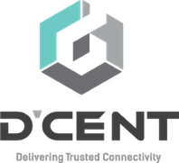
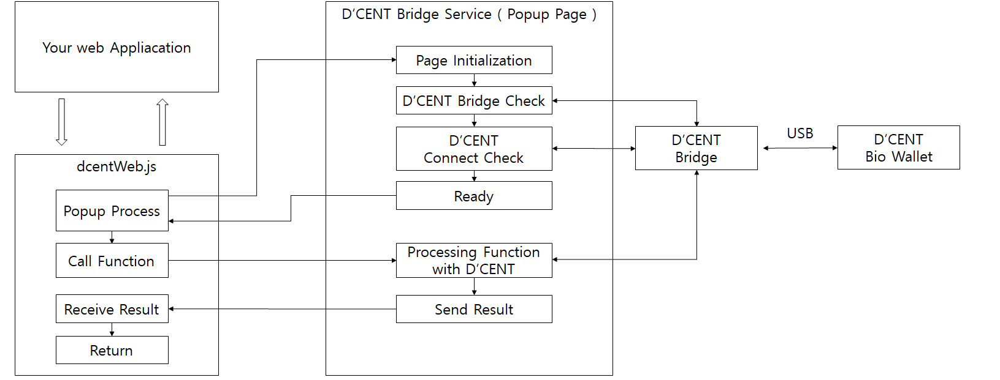

<div style="text-align: right"></div>
<br><br>

# DCENT Web SDK Integration Guide

<br><br>

### VERSION HISTORY
| version | date | modification |
|---|---|---|
| v0.6.2-beta | 2019. 04. 07 | First version of D'CENT Web SDK connector release |
| v0.7.0-beta | 2019. 05. 07 | add KLAYTN transaction function |
| v0.8.0 | 2020. 06. 05 | add 'getSignedMessage' function |
| v0.9.0 | 2020. 06. 22 | add interface for BITCOIN transaction |

<br><br><br>

## 1. INTRODUCTION
D'CENT Web SDK allows your web application to quickly create an wallet application using D'CENT dongle.<br>
This guide explains how to install DCENT Web SDK and use the SDK for your web wallet application.

## 2. Architecture
The figure below is a D'CENT Web SDK structure.
<div></div>
<br>

When the functions is called, if the D'CENT Bridge Service is not running as a popup, the popup window is automatically opened internally and a request to process the function is transmitted.

## 3. PACKAGES
D'CENT Web SDK includes:
- doc : Integration guide and API documentation of DCENT Web SDK.
- src : DCENT Web SDK library file.

## 4. GETTING STARTED

Developers can develop wallet application using our web sdk. Install the `dcent-web-connector` from npm repository.

```js
const DcentWebConnector = require('dcent-web-connector')
```

Developer can access api through `window.DcentWebConnector` object or `DcentWebConnector` object.

### Requirement
- Must have a `D'CENT Biometric wallet`. You can get "Order Now" page of D'CENT homepage. (http://dcentwallet.com)
- You need to install the lastest `D'CENT Bridge`. (http://bridge.dcentwallet.com/download)
- D'CENT Biometric will be connected with your PC or Labtop using USB Cable(Micro USB 5-pin type).


## 5. DEVELOPMENT

### Functions
All API functions return a `Promise`. <br>
When function processing is completed, it is resolved. If an error occurs, it is rejected.<br>
In either case, respond with a JSON object.<br>


### Returned JSON object type
```js
{
    "header": {
        "version": "1.0",
        "request_from": "",
        "status": ""
    },
    "body": {
        "command" : "",
        "parameter" : {}
    }
}
```
<br>

### Common Errors

If D'CENT wallet isn't connected via USB, you'll get the following error:
```js
{
    "header": {
        "version": "1.0",
        "request_from": "wam",
        "status": "error"
    },
    "body": {
        "error": {
            "code": "no_device",
            "message": "D'CENT Biometric Wallet is not connected"
        }
    }
}
```

If the bridge service popup window is closed while calling a function and waiting, the following error occurs:
```js
{
    "header": {
        "version": "1.0",
        "request_from": "dcent-web",
        "status": "error"
    },
    "body": {
        "error": {
            "code": "pop-up_closed",
            "message": "Pop-up windows has been closed"
        }
    }
}
```

When executing a function that requires user authentication, an error occurs if the user cancels the authentication.
The following shows the user cancel error in the Ethereum signed Transaction.
```js
{
    "header": {
        "version": "1.0",
        "request_from": "ethereum",
        "status": "error"
    },
    "body": {
        "command": "transaction",
        "error": {
            "code": "user_cancel",
            "message": "user cancel"
        }
    }
}
```

### DcentWebConnector initialize
`dcent-web-connector` provides functions for using D'CENT Biometric Wallet.

```js
var result
try{
    result = await DcentWebConnector.info()
}catch(e){
    result = e
}
```
`info()` returns :
```js
{
    "header": {
        "version": "1.0",
        "request_from": "",
        "status": ""
    },
    "body": {
        "command" : "",
        "parameter" : {
            "version": "1.0.0",
            "isUsbAttached": "true | false"
        }
    }    
}
```

When the function is called from your web application, if D'CENT Bridge Service is not running as a pop-up, `dcent-web-connector` will automatically open a pop-up window and send a function request

### Set TimeOut Time
Sets the maximum time the function will run.
Once set the timeout Time, it is valid until the value is set again.
The default value is 60 seconds.

You can set the timeout time by calling `setTimeOutMs ()` as shown below.
```js  
  try {
    await dcent.setTimeOutMs(60000) // 60 sec, The default value is 60 seconds.
  } catch (e) {
    console.log(e)    
  }
```

All functions except setTimeOutMs function are called and then respond with `JSON Object` as below when timeout occurs.

```json
  {
    "header": {
      "version": "1.0",
      "response_from": "dcent-web",
      "status": "error"
    },
    "body": {
      "error": {
        "code": "time_out",
        "message": "The function execution time has expired"
      }
    }
  }
```

### Close pop-up window 
`dcent-web-connector` will automatically open a pop-up window and send a function request. 
After each request to device is ended, it is recommended to close popup for enhancing user experience.
```js
var result
try{
    result = await DcentWebConnector.info()    
}catch(e){
    result = e
}
// close pop-up window of D'CENT Bridge Service
DcentWebConnector.popupWindowClose()
```

### Set Device Connection Listener
Set listener for device connection state. Before processing a functions request, `dcent-web-connector` check the device connection state. If the state is changed, the device connection listener will be called. 
```js
// device connection listener ( callback )
function connectionListener(state) {
    if (state === DcentWebConnector.state.CONNECTED) {
        console.log('DCENT is Connected');        
    } else if (state === DcentWebConnector.state.DISCONNECTED) {
        console.log('DCENT is Disconnected');  
    }
}
try {
    // set the device connection listener
    DcentWebConnector.setConnectionListener(connectionListener)
} catch(e) {    
}

```

### Get Device Info
You can get connected device information using `getDeviceInfo()` function.
```js
// Get connected device information
var result
try{
    result = await DcentWebConnector.getDeviceInfo()
}catch(e){
    result = e
}
```
`getDeviceInfo()` returns :
```json
{
    "header": {
        "version": "1.0",
        "response_from": "device",
        "status": "success"
    },
    "body": {
        "command": "get_info",
        "parameter": {
            "device_id": "1234567890123456789012345678901234567890123456789012345678901234",
            "fw_version": "1.2.1.7c65",
            "ksm_version": "1.0.0.1139",
            "state": "secure",
            "coin_list": [
                {
                    "name": "BITCOIN"
                },
                {
                    "name": "ETHEREUM"
                },
                {
                    "name": "ERC20"
                },
                {
                    "name": "RSK"
                },
                {
                    "name": "RRC20"
                },
                {
                    "name": "RIPPLE"
                },
                {
                    "name": "MONACOIN"
                },
                {
                    "name": "EOS"
                },
                {
                    "name": "KLAYTN"
                }
            ],
            "fingerprint": {
                "max": 2,
                "enrolled": 1
            },
            "label": "My D'CENT"
        }
    }
}
```
- deviceId : device unique identifier
- label : label of the device
- fw_Version : firmware version of the device
- ksm_Version : KSM(software running on SE) version of the device
- coin_List : the list of coin which the device supported
(Refer to https://dcentwallet.com/SupportedCoin)

### Set Device Label
If you want to change the label of device, you can do it using `setLabel()` fucntion.
```js
var result
try{
    result = await DcentWebConnector.setLabel("IoTrust")
}catch(e){
    result = e
}
```
After execute above code, you can see the modified label on your device when reboot the device.

### Add & Sync Account
You can add account using `syncAccount()` function. You can create an account by specifying the coin type and key path of the account you want to add.
If you want to add token type coin account, you must specify the coin name as the first 14 digits of contract address.

```js
let account_infos = [{
    coin_group: DcentWebConnector.coinGroup.ETHEREUM,
    coin_name: DcentWebConnector.coinName.ETHEREUM,
    label: 'ETHEREUM_1', // account label
    balance: '0 ETH', // {String} balance of account. This string will be displayed on device.
    address_path: "m/44'/60'/0'/0/0" // key path of the account. This address_path is displayed on the device with the corresponding address and QR code.
}]

var result
try{
    // Ethereum account will be created.
    result = await DcentWebConnector.syncAccount(account_infos)
}catch(e){
    result = e
}
```
`syncAccount()` method can be used also for updating account. If the account of the specified key path is already exist, the `syncAccount()` method do not create account just sync the account information. For example, if you want to change the label of account or modify the balance, you can use the `syncAccount()` method.

```js
let account_infos = [{
    coin_group: DcentWebConnector.coinGroup.ETHEREUM,
    coin_name: DcentWebConnector.coinName.ETHEREUM,
    label: 'ETH_1', // account label
    balance: '1 ETH', // {String} balance of account. This string will be displayed on device.
    address_path: "m/44'/60'/0'/0/1" // key path of the account. This address_path is displayed on the device with the corresponding address and QR code.
}]

// This Ethereum account is already created.
// So the Ethereum account label and balance will be just modified.
var result
try{
    // Ethereum account will be updated.
    result = await DcentWebConnector.syncAccount(account_infos)
}catch(e){
    result = e
}
```

### address_path
address_path follows the BIP44 rules.
```
m / purpose' / coin_type' / account' / change / address_index
```
Accounts are distinguished by `account` in address_path.

```js
let account_infos = [{
    coin_group: DcentWebConnector.coinGroup.ETHEREUM,
    coin_name: DcentWebConnector.coinName.ETHEREUM,
    label: 'ETH_2', // account label
    balance: '0 ETH', // balance of account. This string will be displayed on device.
    address_path: "m/44'/60'/1'/0/0" // key path of the account. This address_path is displayed on the device with the corresponding address and QR code.
}]

var result
try{
    // A New Ethereum account is created.
    result = await DcentWebConnector.syncAccount(account_infos)
}catch(e){
    result = e
}
```

### Retrieve Account
You can retrieve account list of connected device using `getAccountInfo()` function.

```js
var result
try{
    // A New Ethereum account is created.
    result = await DcentWebConnector.getAccountInfo()
}catch(e){
    result = e
}
```
Returned account object has:
```json
{
    "header": {
        "version": "1.0",
        "response_from": "coin",
        "status": "success"
    },
    "body": {
        "command": "get_account_info",
        "parameter": {
            "account": [
                {
                    "coin_group": "ETHEREUM",
                    "coin_name": "ETHEREUM",
                    "label": "eth_1",
                    "address_path": "m/44'/60'/0'/0/0"
                }
            ]
        }
    }
}
```
- label : label of account
- coinGroup : coin group name of account
- coinName : coin name of account
- addressPath : address path of account

### Get Address
You can get address of account using `getAddress()` function.
```js
var coinType = DcentWebConnector.coinType.ETHEREUM
var keyPath = "m/44'/60'/0'/0/0" // key path of the account

var result
try{
    // Get Ethereum Address corresponding to keyPath
    result = await DcentWebConnector.getAddress(coinType, keyPath)
}catch(e){
    result = e
}
```
Returned response object has:
```json
{
    "header": {
        "version": "1.0",
        "response_from": "ethereum",
        "status": "success"
    },
    "body": {
        "command": "get_address",
        "parameter": {
            "address": "0x354609C4c9a15d4265cF6D94010568D5Cf4d0c1B"
        }
    }
}
```
The address string format is depend on the coin type.

### Get XPUB
You can get xpub using `getXPUB()` function.
The BIP32 key path must be at least 2 depth or more.
```js
var keyPath = "m/44'/0'" // key path of the account

var result
try{
    // Get extended public key corresponding to keyPath
    result = await DcentWebConnector.getXPUB(keyPath)
}catch(e){
    result = e
}
```
Returned response object has:
```json
{
    "header": {
        "version": "1.0",
        "response_from": "coin",
        "status": "success"
    },
    "body": {
        "command": "xpub",
        "parameter": {
            "public_key": "xpub6Bp87egy.....EdAH4sMeqY3"
        }
    }
}
```
The public_key is xpub value. 

### Ethereum Signed Massage
You can get a signature value to sign a user message with that private key With a given key path (BIP32).
The input message is prefixed with 'Ethereum sign message' and then hashed and signed.
```js
var message = 'This is a message!'
var result
try {
    result = await dcent.getEthereumSignedMessage(message, "m/44'/60'/0'/0/0");
} catch (e) {
    console.log(e)
    result = e
}
```
Returned response object has:
```json
{
    "header": {
        "version": "1.0",
        "response_from": "ethereum",
        "status": "success"
    },
    "body": {
        "command": "msg_sign",
        "parameter": {
            "address": "0x54b9c508aC61Eaf2CD8F9cA510ec3897CfB09382",
            "sign": "0x0d935339......06a6291b"
        }
    }
}
```


### Signed Massage
You can get a signature value to sign a user message with that private key With a given key path (BIP32).
The input message is prefixed depending on the coin type and then hashed and signed.
```js
var message = 'This is a message!'
var key =  "m/44'/60'/0'/0/0"
var result
try {
    result = await dcent.getSignedMessage( DcentWebConnector.coinType.ETHEREUM, key, message);
} catch (e) {
    console.log(e)
    result = e
}
```
Returned response object has:
```json
{
    "header": {
        "version": "1.0",
        "response_from": "ethereum",
        "status": "success"
    },
    "body": {
        "command": "msg_sign",
        "parameter": {
            "address": "0x54b9c508aC61Eaf2CD8F9cA510ec3897CfB09382",
            "sign": "0x0d935339......06a6291b"
        }
    }
}
```


### Sign Transaction
The D'CENT Web SDK provides functions for signing transaction of coins.

**getEthereumSignedTransaction()**
- This fuction for :
    - ETHEREUM
    - RSK

- Parameters :
    - coinType
    - nonce
    - gasPrice
    - gasLimit
    - to (address)
    - value
    - data
    - key path for signing
    - chain ID

- Returned response object:
    ```json
    {
        "header": {
            "version": "1.0",
            "response_from": "ethereum",
            "status": "success"
        },
        "body": {
            "command": "transaction",
            "parameter": {
                "sign_v": "0x78",
                "sign_r": "0xf9e4c3ed......9557ad37",
                "sign_s": "0x697a2abf......b76c4cb2",
                "signed": "f86c0884......b76c4cb2"
            }
        }
    }
    ```
**getTokenSignedTransaction()**
- This fuction for :
    - ERC20
    - RRC20

- Parameters :
    - coinType
    - nonce
    - gasPrice
    - gasLimit
    - value
    - key path for signing
    - chain ID
    - contract information :
        ```js
        // example
        {
          name: 'OmiseGO',
          address: '0xd26114cd6EE289AccF82350c8d8487fedB8A0C07',
          to: '0x354609C4c9a15d4265cF6D94010568D5Cf4d0c1B',
          decimals: 18,
          value: '100000000000000000',
          symbol: 'OMG'
        }  
        ```            

- Returned response object:
    ```json
    {
        "header": {
            "version": "1.0",
            "response_from": "erc20",
            "status": "success"
        },
        "body": {
            "command": "transaction",
            "parameter": {
                "signed": "0xf8a91584......cc79c29a",
                "sign": {
                    "sign_v": "0x26",
                    "sign_r": "0x33930787......d4456f53",
                    "sign_s": "0x708126c7......cc79c29a"
                }
            }
        }
    }
    ```

**getKlaytnSignedTransaction()**
- This fuction for :
    - KLAYTN
    - KLAYTN_KCT

- Parameters :
    - coinType
    - nonce
    - gasPrice
    - gasLimit
    - to (address)
    - value
    - data
    - key path for signing
    - chain ID
    - Transaction type
    - from (address)
    - fee ratio
    - contract information :
        ```js
        // example
        {
          name: 'COSM',
          decimals: 18,
          symbol: 'COSM'
        }  
        ```

- Returned response object:
    ```json
    {
        "header": {
            "version": "1.0",
            "response_from": "klaytn",
            "status": "success"
        },
        "body": {
            "command": "transaction",
            "parameter": {
                "sign_v": "0x4055",
                "sign_r": "0x5b1a8134......697ce449",
                "sign_s": "0x6aea20f1......9eb816fb"
            }
        }
    }
    ```
For broadcast the sign value, you must encoding the parameter values using RLP.
Klaytn provides 'caver-js' library. You can make raw transaction for broadcasting using 'caver-js'.
(https://docs.klaytn.com/bapp/sdk/caver-js/api-references)


**getBitcoinSignedTransaction()**
- This fuction for :
    - BITCOIN
    - MONACOIN

- Parameters :
    - transaction: this value generated by `getBitcoinTransactionObject()`
- Useage:
    ```js
    // generate Bitcoin Transaction object
    let transaction = dcent.getBitcoinTransactionObject(dcent.coinType.BITCOIN)
    // Set input parameter(previous tx) in Bitcoin Transaction object
    transaction = dcent.addBitcoinTransactionInput(transaction,
        '0100000001e297417c46........293fce63b88ac00000000', //  full of previous tx data
        1, // index of previous tx output to be sent
        dcent.bitcoinTxType.p2pkh, // bitcoin tx type for this UTXO
        "m/44'/0'/0'/1/0") // signing key path
    transaction = dcent.addBitcoinTransactionInput(transaction,
        '0100000001e297417c46.........93fce63b88ac00000000',
        0,
        dcent.bitcoinTxType.p2pkh,
        "m/44'/0'/0'/0/7")
    // Set output parameter(spending information) in Bitcoin Transaction object
    transaction = dcent.addBitcoinTransactionOutput(transaction,
            dcent.bitcoinTxType.p2pkh, // transaction type or this field can indicate output as a “change”
            '10000', // amount of coin to spend. Satoshi unit.
            ['1traqiFvydVk2hWdCj3WGRJbe4CGtfyHA']) // Base58Check encoded address of the receiver.
        result = await dcent.getBitcoinSignedTransaction(transaction)
    ```

- Returned response object:
    ```json
    {
        "header": {
            "version": "1.0",
            "response_from": "erc20",
            "status": "success"
        },
        "body": {
            "command": "transaction",
            "parameter": {
                "signed": "0100000002233ee1fbcf.....71e088ac00000000"
            }
        }
    }
    ```

**getXrpSignedTransaction()**
- This fuction for :
    - XRP(Ripple)

- Parameters :
    - transaction: this value conforms JSON format of Transaction Types in [XRP Doc](https://xrpl.org/transaction-formats.html).
    - key: key path, wallet sign with that private key with a given key path (BIP32 ex) "m/44'/144'/0'/0/0").
- Requirements:
    - `D'CENT Bridge` version 1.1.4 or higher is required.
    - D'CENT Biometric Wallet version 2.4.0. or higher is required.
- Useage:
    ```js
    const transactionJson = {
        "TransactionType": "AccountSet", // or use defined value `dcent.xrpTxType.AccountSet`
        "Account": "rfQrsnD8ywrgSX457qshpBTDru7EDnM2Lb",
        "Fee": "10",
        "Sequence": 34,
        "MessageKey": "02000000000000000000000000415F8315C9948AD91E2CCE5B8583A36DA431FB61",
        "Flags": 2147483648, // if exist then D'Cent check that `tfFullyCanonicalSig` is set?
    }

    var result
    try {
        result = await dcent.getXrpSignedTransaction(transactionJson, "m/44'/144'/0'/0/0");    
    } catch (e) {
        console.log(e)
        result = e
    }
    ```
- Returned response object:
    ```json
    {
        "header": {
            "version": "1.0",
            "response_from": "ripple",
            "status": "success"
        },
        "body": {
            "command": "get_sign",
            "parameter": {
                "sign": "3045022100e81c9e2...8e373e30b8f5e0a33eb094ffc7c8d009ad71fd7581b6b89ef9",
                "pubkey": "02c65f2a496909123973282c47edbd0e760bb44bb0d87ec1b30115b2ce3072c766",
                "accountId": "462a5a061ebe03fb52e5bca443233bcc6d0e9699"
            }
        }
    }
    ```
For broadcast the sign transaction, you must reconstruct transaction include `TxnSignature` & `SigningPubKey` for normal (single-signature) or `Signers` array for multi-signed-transaction 

Please Refer to the `index.html` to learn more about how to use the SDK APIs. There is an Web project using our Web SDK.
